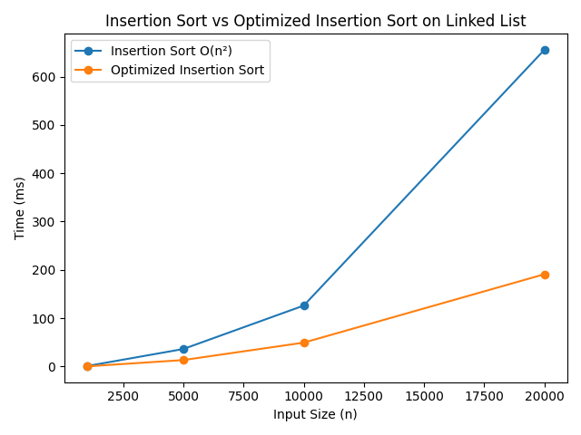

# Analysis
1. How did you implement the linked list? (no plot is needed)
    To implement the linked list, I created an empty node object which contains a data of 0 and has set the next pointer to Null and an empty LinkedList object with it set     Null. Then to build the list, I created an insertAtHead() function which creates a newNode. The newNode's data is set to the data passed in as a parameter and the next
    pointer of the newNode is set to head while the current head of the list is set to the newNode to indicate the top of the list.
2. How long does it take to sort the list across different input sizes? (Include a plot supporting this data).
   

   As you can see from the plot, at a list size of n=20000 it takes approx 600ms to sort the linked list. At n=10000 we can see it takes approx 100ms and at n=5000, it
   takes just under 100ms. This is because the time complexity of insertion sort (worst case) is O(n^2) due to the nested for loop. 
3. How did you optimize your code? How much faster is the improved version, and why? (Include a plot supporting this data).
   

   To optimize the insertion sort, I created a sortedTail pointer which keeps track of the last node in the sorted part of the linked list. When inserting each new node, I    first check if its data is greater than or equal to the data in sortedTail. If it is, the new node can be added directly to the end of the sorted list without having to    search through the list. Otherwise, the code searches through the sorted list to find the correct position for the new node and inserts it there. This improves the         performance because the original insertion sort has to search through the sorted list each time a new node is inserted. With the optimized version, if the new value        is already larger than the last sorted value, it can be added immediately. This is especially useful when the list is already sorted or nearly sorted, as the optimized     version can sort the list in O(n) time in the best case, compared to O(n²) for the original insertion sort. As we can see, across all n sized linked lists we plotted
   for (n=5000,10000,20000), we measure less than 100ms to sort the linked list via the optimized insertion sort method.

4. To be able to show the most distinction between the two sorting algorithms, I created a test data that had performed 80% of n swaps on the list so the list was still quite disordered and partially unsorted, but retained some of its original ordering, allowing us to see a distinction in the sorting speed between the two algorithms.


   
   


# basics
This tutorial teaches you how to build and run your labs in CE 4SP4:


### Logging in to the Teach Cluster
* More info about the (Teach Clsuter)[https://docs.scinet.utoronto.ca/index.php/Teach]
* What is compute node? what is login node?
* ssh to the teach cluster using ```ssh <username>@teach.scinet.utoronto.ca```
* `username` and password are already provided to you. Please do not share it with anyone
* What is `home` directory? What is `scratch` directory?
* Use `cd $SCRATCH` to go to the scratch directory
* Use `scp`to copy files from your local machine to the teach cluster and vice versa.


### Cloning and Buidling the repository
* Use `git clone https://github.com/cheshmi/basics.git` to clone the repository in your scratch directory
* What is `git`?
* Use `cd basics` to go to the directory
* You first need to build the code using `bash build.sh`.
* What does the `build.sh` do? What us CMake?
* What is the profiling flag in the `build.sh` script?


### Running the code
* Use `sbatch run_teach_cluster.sh` to run the code on a compute nod of the teach cluster
* What is the difference between `sbatch` and `bash`?
* You should never run the code on the login node (unless it takes less than 30 seconds). Why?
* What is the output of the code?
* What does 'run_teach_cluster.sh' do?
* You can check the status of of your job using `squeue -u <username>`. What is the output of this command?


### What is Google Benchmark?
* Google Benchmark is a C++ library to benchmark code. See more info [here](https://github.com/google/benchmark/blob/main/docs/user_guide.md)
* How do you read google benchmark output?
* How can I parse CSV? Python?
* Find the list of supported counter using `perf list`. See more info [here](https://github.com/google/benchmark/blob/main/docs/perf_counters.md)


### Local setup
* Pick your editor. 
* We show you how to use CLion to setup the code.
